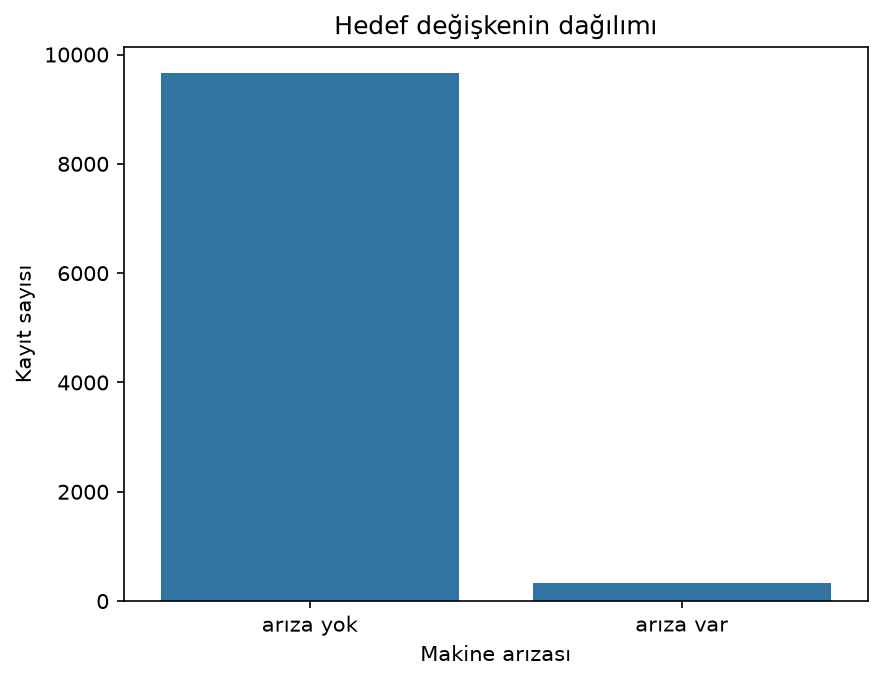
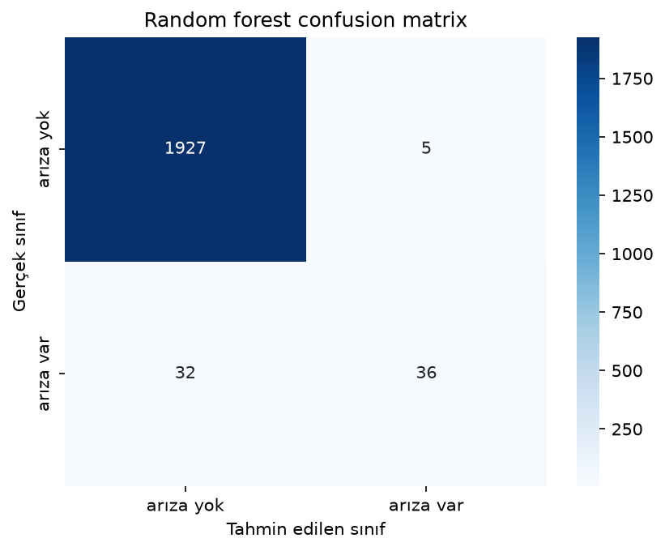
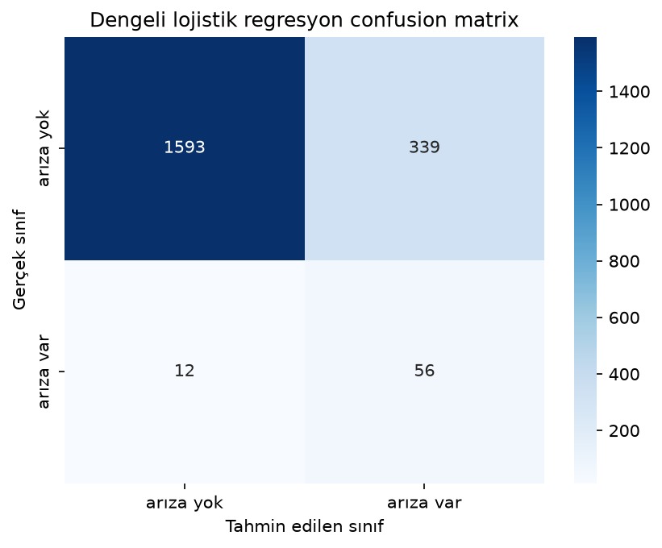
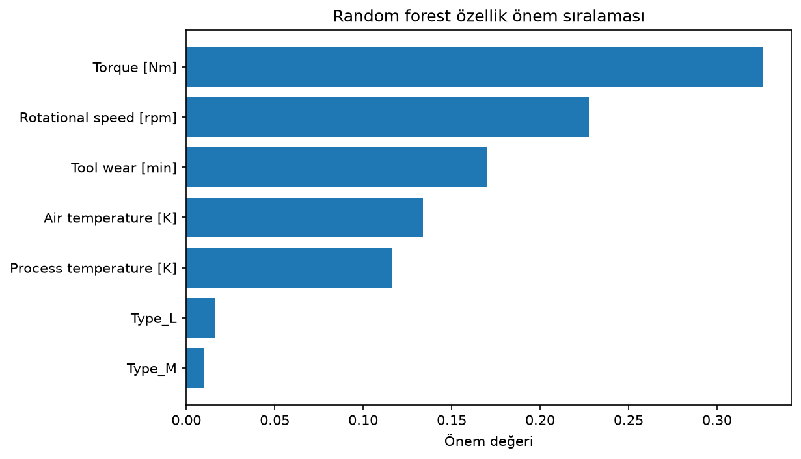
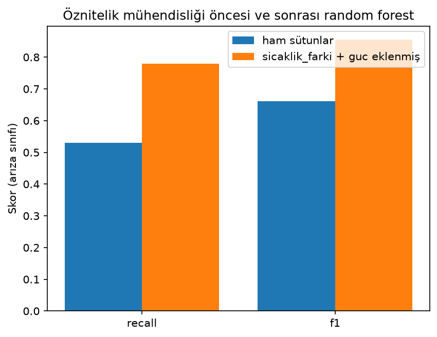
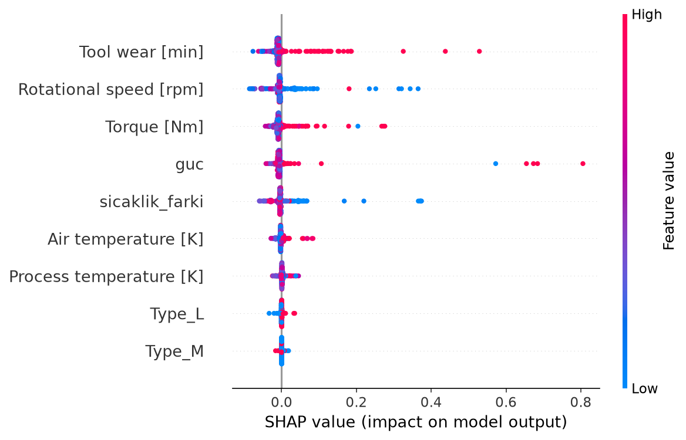

# Makine arızasını önceden tahmin edebilir miyiz?

Türkiye Yapay Zeka Akademisi ile Huawei Student Developers'ın birlikte düzenlediği Veri Bilimi ve Makine Öğrenmesi Bootcamp'inin final ödevi için kendi projemizi yapıp süreci yazmamız istendi. Konu seçerken çok gezinmedim. Üretim sektörüne zaten ilgim vardı ve bir yerde okuduğum bir bilgi aklıma takılmıştı: üretim hattındaki plansız bir duruşun maliyeti, planlı bakımın kat kat üstünde olabiliyor. Madem makineler sensörle dolu, arızayı olmadan önce tahmin etmeyi deneyebilirim dedim. Bunun literatürdeki adı kestirimci bakım, yani predictive maintenance.

Bütün çalışmayı Google Colab'da yaptım, hocanın derslerindeki akışı elimden geldiğince takip ettim.

## Veri seti

Veri setini önce Kaggle'da buldum, "Machine Predictive Maintenance Classification" adıyla geçiyor. Açıklamasını okuyunca orijinalinin UCI'daki AI4I 2020 Predictive Maintenance veri seti olduğunu gördüm ve onu kullandım. 10.000 satır, 14 sütun. Her satır bir üretim kaydı: hava sıcaklığı, proses sıcaklığı, dönüş hızı, tork, takım aşınması gibi sensör değerleri ve ürünün kalite sınıfı (L, M, H). Hedef değişken Machine failure, 0 ya da 1.

İlk countplot'u çizince işin rengi belli oldu. 10.000 kaydın sadece 339'u arıza, yani %3.4.



Hoca derste dengesiz veri setlerinden bahsetmişti ama kendi verimde bu kadar bariz göreceğimi düşünmemiştim. Bu dengesizlik, yazının geri kalanındaki neredeyse her kararı belirledi.

## İlk deneme ve şüpheli derecede iyi skor

Burası itiraf kısmı. Veri setinde TWF, HDF, PWF, OSF, RNF diye beş sütun var. İlk denemede bunların ne olduğuna kafa yormadan hepsini modele verdim. Random forest'ın accuracy'si 0.999 çıktı. Önce sevindim, bir an "final ödevi bitti" bile dedim. Sonra bir gariplik hissettim, çünkü arıza sınıfındaki recall bile 0.97'ydi ve ilk denemede bu kadar iyi olması normal değildi. Sütun açıklamalarını dikkatli okuyunca anladım: bu beş sütun arızanın alt tipleri. Model "arıza var mı" sorusuna, içinde arıza tipinin zaten yazılı olduğu sütunlara bakarak cevap veriyordu. Buna veri sızıntısı (data leakage) deniyor ve fark etmem yarım günümü aldı.

O beş sütunu, bir de kimlik bilgisi olan UDI ve Product ID sütunlarını çıkardım. Type sütununu one-hot encoding ile sayısala çevirdim:

```python
# TWF/HDF/PWF/OSF/RNF arıza tipinin alt etiketleri, hedefi sızdırıyor
df_model = df.drop(["UDI", "Product ID", "TWF", "HDF", "PWF", "OSF", "RNF"], axis=1)
df_model = pd.get_dummies(df_model, columns=["Type"], drop_first=True, dtype=int)
```

## Üç model ve accuracy tuzağı

Veriyi %80 eğitim, %20 test olarak ayırdım, stratify=y ile %3.4'lük arıza oranı iki kümede de korundu. Lojistik regresyon için değişkenleri StandardScaler ile ölçekledim, ölçekleyiciyi sadece eğitim verisinde fit ettim. Ağaç tabanlı modellere ham veriyi verdim, hoca derste ağaçların ölçekten etkilenmediğini söylemişti.

```
Lojistik regresyon accuracy: 0.9675
Karar ağacı accuracy: 0.973
Random forest accuracy: 0.9815
```

İlk bakışta üçü de harika. Ama veri setinin %96.6'sı zaten arızasız, yani hiçbir şey öğrenmeden her kayda "arıza yok" diyen bir model bile %96.6 accuracy alır. Hocanın derste söylediği "dengesiz veri setinde accuracy'ye güvenmeyin" cümlesi tam burada oturdu. Bootcamp'e paralel takip ettiğim Andrew Ng kursunda da aynı uyarı skewed datasets başlığıyla vardı; aynı şeyi iki ayrı yerden duyunca insan duruyor. classification_report gerçeği gösterdi: lojistik regresyonun arıza sınıfındaki recall'u 0.10, testteki 68 gerçek arızanın sadece 7'sini yakalıyor. En iyisi random forest, onda da precision 0.88 ama recall 0.53, f1 0.66.



Confusion matrix'te canımı sıkan sol alttaki 32: random forest 68 arızanın 32'sini kaçırıyor. Üretim senaryosunda kaçan her arıza plansız duruş demek, false negative burada en pahalı hata.

Dengesiz veriyle ne yapılır diye google'larken sklearn'ün class_weight parametresine denk geldim, "balanced" deyince azınlık sınıfa daha çok ağırlık veriyor. Bununla lojistik regresyonun recall'u 0.10'dan 0.82'ye fırladı ama precision 0.14'e düştü, kabaca her doğru alarma altı yanlış alarm. İlk başta recall artınca "model düzeldi" diye yazmıştım, sonra precision satırını görüp o paragrafı sildim. Hangisinin daha iyi olduğu bence teknik değil ekonomik bir soru: yanlış alarmın kontrol maliyetiyle kaçan arızanın duruş maliyetini bilen biri karar vermeli.



Random forest'ın feature importance sıralaması da tork (0.33), dönüş hızı (0.23) ve takım aşınması (0.17) diyordu. Arızanın habercisi ürünün kalite sınıfı değil, makinenin o anki çalışma koşulları.



## dokümantasyonu okumak kod yazmaktan çok kazandırdı

Projenin bana en çok şey öğreten bölümü burası ve neredeyse hiç kod yok. Skoru nasıl yükseltirim diye düşünürken UCI sayfasındaki arıza tanımlarını bir daha okudum. HDF (ısı kaynaklı arıza) tanımı hava ve proses sıcaklığı arasındaki farka bakıyor. PWF (güç kaynaklı arıza) tanımı ise tork ile açısal hızın çarpımından hesaplanan gücün 3500-9000 W aralığının dışına çıkmasına. Yani arızayı belirleyen büyüklükler veri setinde ham halde yok, sütunların birleşiminde saklı. Model bunları kendisi türetmeye çalışıyor, ben hazır verirsem işi kolaylaşır:

```python
df_fe["sicaklik_farki"] = df_fe["Process temperature [K]"] - df_fe["Air temperature [K]"]
df_fe["guc"] = df_fe["Torque [Nm]"] * df_fe["Rotational speed [rpm]"] * 2 * np.pi / 60
```

Gücü Watt cinsinden hesaplamak için devri 2 pi / 60 ile rad/s'ye çevirmek gerekiyormuş, o kısmı araştırarak buldum. Aynı ayarlarla random forest'ı yeniden eğittim:

```
Random forest recall: 0.5294117647058824 -> yeni değişkenlerle: 0.7794117647058824
Random forest f1: 0.6605504587155964 -> yeni değişkenlerle: 0.8548387096774194
```

Recall 0.53'ten 0.78'e, f1 0.66'dan 0.85'e. Kaçırılan arıza sayısı 32'den 15'e indi, üstelik yanlış alarm sadece 3. Veri sızıntısını bulmak yarım günümü almıştı, burada on dakikalık okuma ve iki satır kod projedeki en büyük skor artışını getirdi. Yeni feature importance sıralamasında guc ilk sıraya oturdu (0.24), sicaklik_farki da iki ham sıcaklık sütununu geride bıraktı.



## Skorlarım şansa mı bağlı

Bir şey kafama takıldı. 0.855'lik f1 tek bir train/test bölünmesinin sonucu; veri başka türlü bölünseydi aynı skoru görür müydüm? Hocanın cross validation dersindeki StratifiedKFold ile ana modelleri 5 parçada değerlendirdim. Stratified olması önemli, her fold'da %3.4'lük arıza oranı korunuyor. Metrik olarak da f1 seçtim, accuracy'nin bu veride ne kadar boş olduğunu görmüştük.

```
random forest f1: [0.84745763 0.85245902 0.79646018 0.848      0.77586207]
0.8240477778937508
0.031660280245516766
```

Random forest'ın f1 ortalaması 0.824, standart sapması 0.032. Fold'lar 0.776 ile 0.852 arasında geziyor, yani benim tek bölünmedeki 0.855'im biraz iyimser tarafa denk gelmiş ama resim tutarlı. Karar ağacının ortalaması 0.747, dengeli lojistik regresyonunki 0.278. Aradaki uçurum, bu problemde doğrusal sınırın yetmediğini bir kez daha gösterdi.

## Grid search denemesi ve bir düzeltme

n_estimators=100 gibi ayarları şimdiye kadar hocanın derste kullandığı değerlerden almıştım. GridSearchCV verdiğin ızgaradaki bütün kombinasyonları çapraz doğrulamayla deneyip en iyisini söylüyor. Seçtiği şey hiperparametreler, yani modelin eğitimden önce elle verilen ayarları. Özellik seçimiyle karıştırmamak gerekiyor; o iş ayrı ve ben zaten bir önceki bölümde elimle yapmıştım.

Izgarayı küçük tuttum: n_estimators [100, 200], max_depth [5, 10, None], class_weight [None, "balanced"]. 12 kombinasyon, 5 fold ile 60 model eğitimi demek; bu boyutta hepsini denemek sorun değil. (Izgara büyüseydi kombinasyonların tamamı yerine rastgele bir kısmını deneyen RandomizedSearchCV'ye geçerdim.)

Sonuç beni biraz güldürdü. En iyi parametreler class_weight None, max_depth None, n_estimators 200 çıktı, cv skoru 0.84, test f1 0.855. Yani elle seçtiğim ayarlarla neredeyse aynı, test tahminleri birebir aynı çıktı. 60 model eğiten aramanın getirisi sıfır, on dakikalık dokümantasyon okumanın getirisi 0.19 puan. Bu karşılaştırmayı unutmayacağım.

## XGBoost

Andrew Ng'nin kursunda gradient boosting anlatılırken XGBoost geçmişti, kendi verimde denemek istedim. İlk fit denemesinde hata aldım: XGBoost sütun adlarında köşeli parantez kabul etmiyor, "Air temperature [K]" gibi adları temizlemek gerekti. Dengesizlik için de class_weight yerine scale_pos_weight parametresi var, arızasız/arızalı oranını veriyorsun, bende bu oran 28.5.

```
Random forest (grid search): recall: 0.7794117647058824 --- f1: 0.8548387096774194
XGBoost: recall: 0.7647058823529411 --- f1: 0.8253968253968254
XGBoost (scale_pos_weight): recall: 0.8088235294117647 --- f1: 0.8088235294117647
```

scale_pos_weight ile XGBoost 68 arızanın 55'ini yakalayarak en yüksek recall'u verdi ama yanlış alarmları arttığı için f1'de random forest'ın gerisinde kaldı. class_weight denemesindeki ders burada da geçerli: recall kazancı hiçbir zaman bedava değil. f1'e göre en iyi model grid search'ten çıkan random forest olarak kaldı.

## SHAP ile modelin içine bakmak

Son olarak hocanın açıklanabilirlik dersindeki SHAP'ı uyguladım. SHAP adını ilk duyduğumda model eğiten bir yöntem sanıyordum, meğer tam tersiymiş: eğitilmiş bir modeli alıp her tahminde hangi değişkenin sonucu hangi yöne ittiğini hesaplıyor. Hesap uzun sürdüğü için test setinin ilk 500 örneğini kullandım.

```python
shap_explainer = shap.TreeExplainer(grid_search.best_estimator_)
shap_values = shap_explainer.shap_values(X_shap)
shap.summary_plot(shap_values[:, :, 1], X_shap)
```



Feature importance ile aynı isimler öne çıkıyor ama SHAP yön bilgisini de veriyor ve asıl güzelliği bu. Takım aşınmasının yüksek değerleri (kırmızı noktalar) tahmini arıza yönüne itiyor, düşük dönüş hızı da öyle. guc satırında daha ilginç bir desen var: hem çok düşük hem çok yüksek değerler arıza yönüne itiyor. PWF tanımı zaten gücün 3500-9000 W bandının dışına çıkması, yani modelin veriden kendi başına çıkardığı kural dokümantasyondaki tanımla birebir örtüşüyor. sicaklik_farki'nda ise düşük değerler arızaya itiyor, ilk bakışta ters geldi ama HDF tanımı da tam olarak farkın küçülmesine bakıyormuş.

## Bu projeden elimde kalanlar

Somut olarak şunları öğrendim. Skor çok iyi çıktığında sevinmeden önce "neden bu kadar iyi" diye sormak gerekiyor; benim 0.999'luk accuracy'm veri sızıntısıymış. Dengesiz veride accuracy neredeyse hiçbir şey söylemiyor, recall ve f1 okumayı bu projede öğrendim. En büyük sürpriz ise emeğin dağılımıydı: veri setinin dokümantasyonunu okumak f1'i 0.19 puan yükseltti, grid search hiçbir şey kazandırmadı. Bir de modelin sınırını gördüm: RNF sütunundaki rastgele arızalar sensörlere yansımıyor, onları hiçbir model yakalayamaz.

Eksikler de belli. Karar eşiğini (threshold) hiç oynamadım, 0.5 yerine daha düşük bir eşik recall'u ucuza artırabilirdi. Dengesiz veri konusunu araştırırken adı sık geçen SMOTE gibi örnekleme yöntemlerini de denemedim. PCA'yı düşünüp vazgeçtim, 9 değişkenli veride boyut indirmeye gerek görmedim. Sıradaki deneme muhtemelen threshold ayarı olacak, çünkü üretim senaryosunda 15 kaçan arıza hala çok.

Modeli kendiniz denemek isterseniz küçük bir sayfa hazırladım. Sensör değerlerini oynatınca tahmin anında güncelleniyor, hazır senaryoların hepsi de veri setinden gerçek kayıtlar: https://senasayginsenyuz.com/makine-arizasi-tahmini/demo/

Defterin tamamı ve grafikler GitHub'ımda, sena-makine-arizasi-tahmini klasöründe.

Veri seti: [Kaggle](https://www.kaggle.com/datasets/shivamb/machine-predictive-maintenance-classification) ve orijinali [UCI AI4I 2020](https://archive.ics.uci.edu/dataset/601/ai4i+2020+predictive+maintenance+dataset)

Sena Saygın Şenyüz
